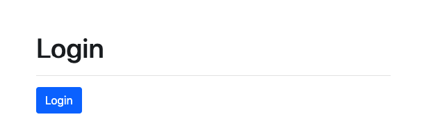
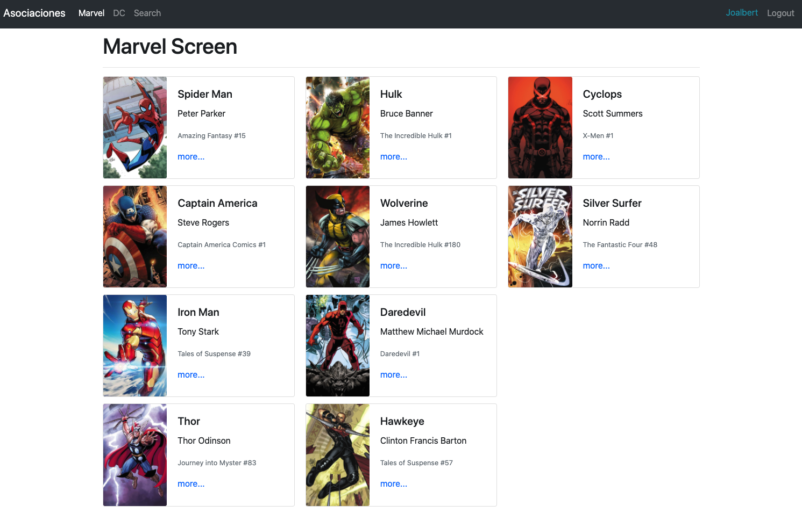
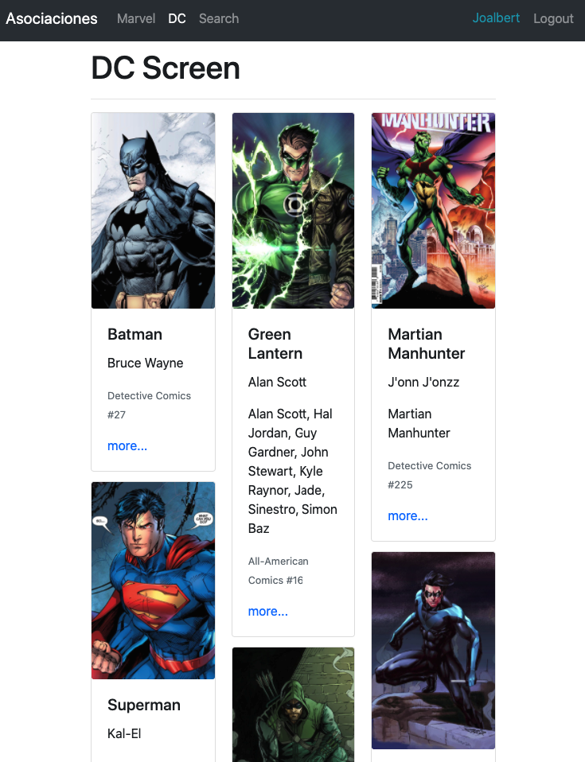
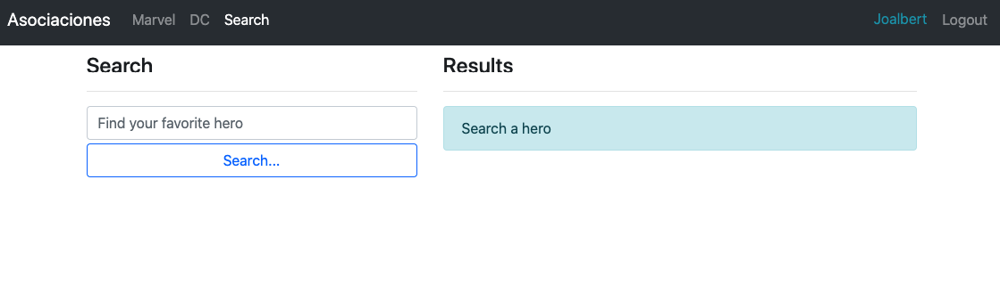
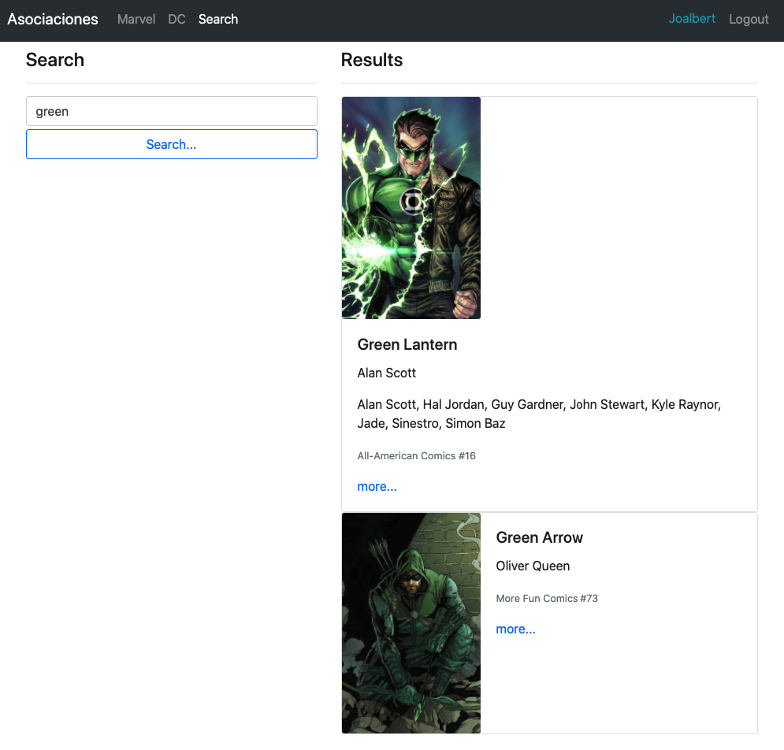
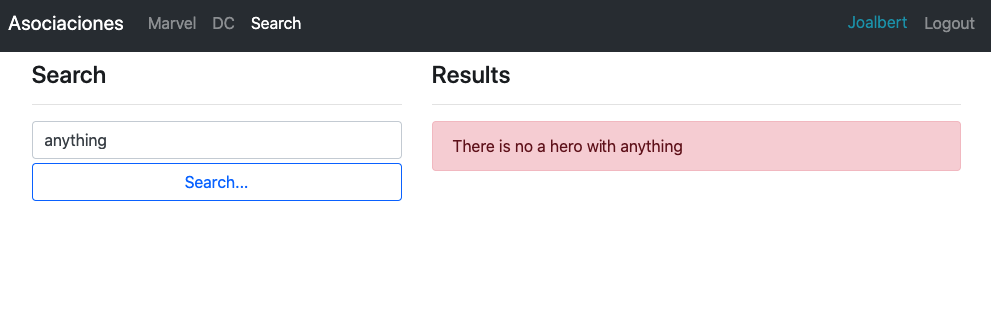

# SPA Heroes App

- [React Router][react_router]
- [Animate CSS][animate_st]

#### Tests
- [Enzyme][enzymejs]
- [enzyme-to-json][enzyme_to_json]
- [React Hooks Testing Library][react_hooks_testing]
- [React Router Testing][react_router_testing]

[react_router]: https://reacttraining.com/react-router/web/guides/quick-start
[animate_st]: https://animate.style/

[enzymejs]: https://enzymejs.github.io/enzyme/
[enzyme_to_json]: https://www.npmjs.com/package/enzyme-to-json
[react_hooks_testing]: https://react-hooks-testing-library.com/
[react_router_testing]: https://reacttraining.com/react-router/web/guides/testing

### Installs

With `package.js` and dependencies
```shell
docker-compose run app yarn
```

Without dependencies
```shell
docker-compose run app yarn add react-router-dom query-string
docker-compose run app yarn add enzyme enzyme-adapter-react-16 --dev
docker-compose run app yarn add enzyme-to-json --dev
docker-compose run app yarn add @testing-library/react-hooks --dev
```

### Screenshots

<p align="center">
  <kbd>
    
  </kbd>
</p>

<p align="center">
  <kbd>
    
  </kbd>
</p>

<p align="center">
  <kbd>
    
  </kbd>
</p>

<p align="center">
  <kbd>
    
  </kbd>
</p>

<p align="center">
  <kbd>
    
  </kbd>
</p>

<p align="center">
  <kbd>
    
  </kbd>
</p>

### Project Structure

> run `tree -I "node_modules|public|screenshots"`
```shell
.
├── Dockerfile
├── README.md
├── docker-compose.yml
├── package.json
├── src
│   ├── HeroesApp.js
│   ├── auth
│   │   ├── AuthContext.js
│   │   └── authReducer.js
│   ├── components
│   │   ├── dc
│   │   │   └── DcScreen.js
│   │   ├── heroes
│   │   │   ├── HeroCard.js
│   │   │   ├── HeroList.js
│   │   │   └── HeroScreen.js
│   │   ├── login
│   │   │   └── LoginScreen.js
│   │   ├── marvel
│   │   │   └── MarvelScreen.js
│   │   ├── search
│   │   │   └── SearchScreen.js
│   │   └── ui
│   │       └── Navbar.js
│   ├── data
│   │   └── heroes.js
│   ├── hooks
│   │   └── useForm.js
│   ├── index.js
│   ├── routers
│   │   ├── AppRouter.js
│   │   ├── DashboardRoutes.js
│   │   ├── PrivateRoute.js
│   │   └── PublicRoute.js
│   ├── selectors
│   │   ├── getHeroById.js
│   │   ├── getHeroByName.js
│   │   └── getHeroesByPublisher.js
│   ├── setupTests.js
│   ├── tests
│   │   ├── auth
│   │   │   └── authReducer.test.js
│   │   ├── components
│   │   │   ├── heroes
│   │   │   │   ├── HeroScreen.test.js
│   │   │   │   └── __snapshots__
│   │   │   │       └── HeroScreen.test.js.snap
│   │   │   ├── login
│   │   │   │   ├── LoginScreen.test.js
│   │   │   │   └── __snapshots__
│   │   │   │       └── LoginScreen.test.js.snap
│   │   │   ├── search
│   │   │   │   ├── SearchScreen.test.js
│   │   │   │   └── __snapshots__
│   │   │   │       └── SearchScreen.test.js.snap
│   │   │   └── ui
│   │   │       ├── Navbar.test.js
│   │   │       └── __snapshots__
│   │   │           └── Navbar.test.js.snap
│   │   ├── fixtures
│   │   │   └── demoAuth.js
│   │   └── routers
│   │       ├── AppRouter.test.js
│   │       ├── DashboardRoutes.test.js
│   │       ├── PrivateRoute.test.js
│   │       └── __snapshots__
│   │           ├── AppRouter.test.js.snap
│   │           └── DashboardRoutes.test.js.snap
│   └── types
│       └── types.js
└── yarn.lock

28 directories, 43 files
```

### Start Project

> run `docker-compose up`

### Tests

> run `docker-compose run app yarn test`

